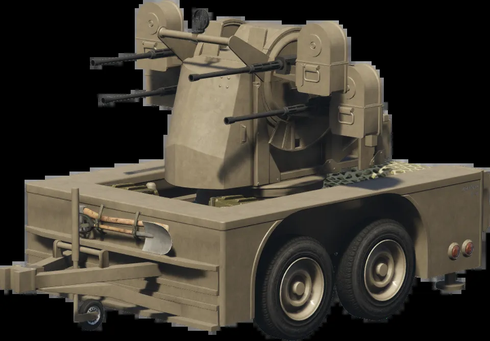

# warsim_remolque: remolque de artillería



- **Nombre en GTA:** Anti-Aircraft Trailer (del DLC Gunrunning)
- **Nombre de spawn / modelo:** `trailersmall2`
- Viene con el juego, así que **no hace falta hacer stream de ningún archivo**.
- Para disparar, un jugador se sube al remolque (asiento del artillero) y controla el cañón.

## Instalación en el servidor FiveM

1. Copia la carpeta `warsim_remolque` dentro de `resources/` del servidor
   (por ejemplo `resources/[warsim]/warsim_remolque`).
2. En `server.cfg` añade:
   ```
   ensure warsim_remolque

   # Quién puede sacar/borrar el remolque con comando
   add_ace group.admin warsim.remolque allow
   ```
   Si quieres que lo pueda sacar cualquiera, pon `Config.UsarPermisos = false` en `config.lua`.
3. Reinicia el servidor (o usa `refresh` y `ensure warsim_remolque` en la consola).

## Uso en el juego

| Acción | Cómo |
|---|---|
| Sacar el remolque detrás de ti | `/remolque` |
| Borrar tu remolque | `/borrarremolque` |
| Enganchar / desenganchar | Súbete como conductor, da marcha atrás hasta que el enganche quede a menos de 4 m del morro del remolque y pulsa **H** |

Cada jugador puede cambiar la tecla en *Ajustes > Asignación de teclas > FiveM*.

## Elegir a qué vehículos se puede enganchar

Abre `config.lua` y edita la lista `Config.VehiculosPermitidos` con los **nombres de spawn**
de los vehículos que queráis:

```lua
Config.VehiculosPermitidos = {
    'insurgent',
    'barracks',
    'mesa3',
    'mitanque',   -- también sirven vehículos addon, con su nombre de spawn
}
```

- Solo esos vehículos pueden engancharlo, ya sea con la tecla o dando marcha atrás como
  hace GTA por defecto. A los demás se les suelta automáticamente.
- Si pones `Config.PermitirTodos = true`, cualquier vehículo podrá engancharlo.
- Si un vehículo no tiene punto de enganche en su modelo, el script pega el remolque detrás
  de forma rígida para que se pueda llevar igualmente.
- Si queréis que el script controle otros remolques, añadidlos a `Config.Remolques`
  (por ejemplo `'trailersmall'`, `'boattrailer'`, `'trailers4'`).
